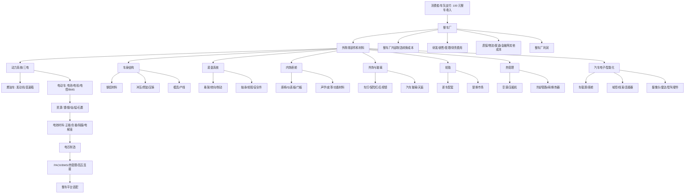

# 汽车供应链学习地图

- Created: 2026-08-03 Asia/Shanghai
- Purpose: 记录汽车供应链的树状学习地图，防止后续讨论时漏掉已提到但尚未理解的分支。

## 口径

从整车厂“每 100 元整车收入”拆起，再继续拆外购零部件和材料。不能把整车厂外购金额、Tier1 收入、Tier2 收入、材料商收入直接相加；它们是同一辆车成本在不同层级的流转，会重复计算。

## 总图

## 阅读顺序

1. 先看整车厂：100 元收入里，多少被外购零部件和材料拿走，多少留给整车厂承担制造、研发、销售和利润。
2. 再看 Tier1：谁直接卖给整车厂，单车价值量多少，是否通过认证和客户绑定留住利润。
3. 再看 Tier2 和材料：它们经常影响 Tier1 成本，但不应与 Tier1 收入重复相加。
4. 最后看利润留存：同样在汽车供应链里，有的环节赚品牌/技术/认证钱，有的只是赚加工费，有的赚周期价差。

## 当前未展开分支

- 电池产业链：已展开资源、材料、电芯、PACK/BMS、整车平台适配；后续可补各环节上市公司和利润分布。
- 热管理：燃油车空调向电动车热管理系统升级后，单车价值量和竞争格局怎么变。
- 汽车电子：区分高壁垒系统方案和低毛利硬件组装。
- 成熟耗材：轮胎、玻璃这类成熟部件为什么可能比整车更稳定。
- 模具/设备：为什么它们更像资本开支周期，而不是整车销量线性受益。
